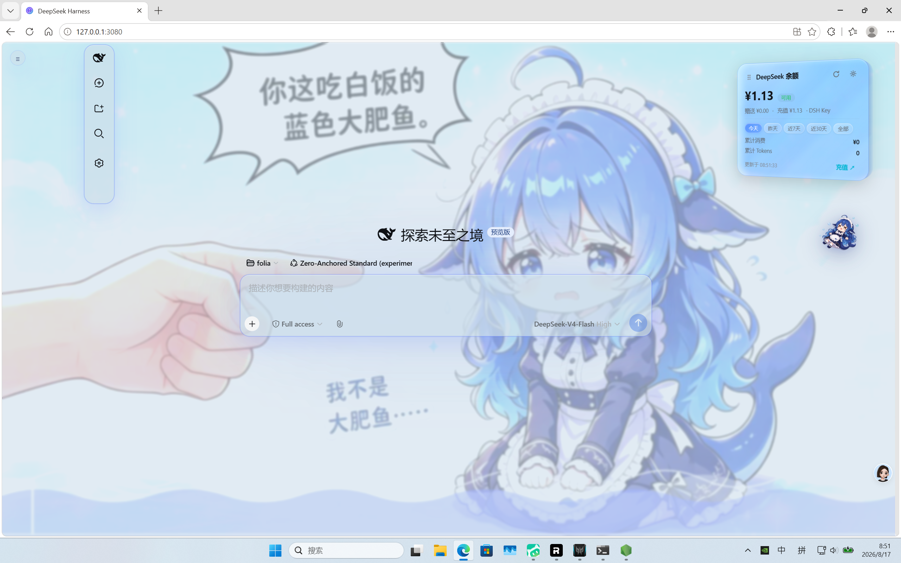

# DSH 潮汐液态玻璃皮肤 · DSH Tide Liquid-Glass Skin

> 为 **DeepSeek Harness (DSH)** 桌面 / Web 客户端打造的极光潮汐液态玻璃 UI 皮肤：浮动工作窗口、深海焦散、SVG 海浪动画，以及一只可拖动的 Q 版 **DeepSeek 鲸鱼娘**挂件（点击她即弹出玻璃调节面板）。
>
> A polished aurora-tide liquid-glass UI skin for the **DeepSeek Harness (DSH)** web client: floating workspace, deep-sea caustics, animated SVG waves, and a draggable Q-version **DeepSeek whale-girl** companion that opens a glass tuning panel.

---

## ✨ 效果展示 · Screenshots

### ☀️ 浅色主题 · Light Theme


### 🌙 深色主题 · Dark Theme


---

## 🌊 核心特性 · Features

| | 中文 | EN |
|---|---|---|
| 🌌 **极光潮汐背景** | 极光星云与海浪潮汐交织，深海焦散、SVG 波浪带泡沫、漂浮气泡、闪烁星点、海浪飞沫、流星、缓慢旋转的 conic 渐变带。 | Rolling aurora nebula, deep-sea caustics, animated SVG waves with foam, drifting bubbles, sparks, sprays, meteors, and a slow-rotating conic gradient band. |
| 🪟 **全面液态玻璃** | 全部面板（对话 / 侧栏 / 设置弹窗 / 消息气泡 / 输入卡）玻璃化，透明度 / 模糊 / 亮度 / 饱和 / 反光均可调。 | Every panel (chat, sidebar, settings dialog, message bubbles, input card) is glass-tinted with tunable alpha / blur / brightness / saturate / highlight. |
| 🪂 **浮动工作窗口** | 左侧工作区变成可拖动、可折叠（56 px rail）的悬浮窗口，位置跨会话记忆。 | The left sidebar is a draggable, collapsible 56 px rail that floats above the page; position is remembered across sessions. |
| 🐳 **鲸鱼娘挂件** | 右下角陪伴一只 Q 版 DeepSeek 鲸鱼娘，可拖到任意位置，点击即展开玻璃调节面板。 | A Q-version DeepSeek whale-girl sits in the corner — drag her anywhere, click her to open the glass tuning panel. |
| 🎛️ **各区域独立调节** | **全局**与**各区域**（悬浮窗 / 设置页 / 主界面）独立调节；未设置时自动跟随全局。 | Tune glass parameters **globally** or per region (sidebar / settings / main); each region falls back to global when unset. |
| 🌓 **深浅色主题** | 浅色默认 **#cbddeb** 玻璃，深色默认 **#000000** 玻璃，跟随 DSH 主题（浅 / 深 / 跟随系统）。 | Light uses **#cbddeb** glass, dark uses **#000000** glass; theme follows DSH's appearance setting (light / dark / system). |
| 💾 **跨会话状态记忆** | 拖动位置、收起状态、玻璃参数全部跨会话记忆；主题偏好同时持久化到 `settings.yaml`。 | Drag position, collapse state, glass parameters all persist in `localStorage`; theme override also persists to `settings.yaml`. |
| ♻️ **干净卸载** | 卸载后完整还原官方界面，无残留遮罩、监听或 DOM。 | Unloading the skin fully restores the official UI — no leftover overlays, hooks, or DOM. |
| ⚡ **GPU 友好** | 已移除动画层的高成本 `filter: blur`；尊重 `will-change` 与 `prefers-reduced-motion`；大面积使用静态渐变代替实时模糊。 | Heavy `filter: blur` removed from animated layers; `will-change` and `prefers-reduced-motion` honored; large areas use static gradients over live blur. |
| 🌐 **i18n 就绪** | 自带英文 README、中文 README (`README.zh.md`)、`README.i18n.yaml` i18n 元数据。 | README, `README.zh.md`, and `README.i18n.yaml` cover English and Chinese out of the box. |

---

## 📦 安装 · Installation

### 通过 dsh CLI（推荐）· Via `dsh` CLI (recommended)

```bash
# 克隆仓库
git clone https://github.com/SoDaZilla-zzz/dsh-tide-ui.git
cd dsh-tide-ui

# 安装到默认 web profile
dsh plugin --profile web add .

# 激活（dsh 主页管理里选 "潮汐"）
# Windows:
switch-tide-skin.cmd
# 或者直接进 dsh 主页管理 UI 选皮肤。
```

### 从 npm 安装（已发布时）· From npm (if published)

```bash
dsh plugin --profile web add @linxin666/dsh-client-ui-skin-tide
```

### 手动安装 · Manual install

1. 把 `dsh-tide-ui/` 目录复制到 `~/.dsh/profiles/web/node_modules/@linxin666/dsh-client-ui-skin-tide/`
2. 运行 `dsh plugin --profile web add @linxin666/dsh-client-ui-skin-tide`
3. 打开 DSH Web → 主页管理 → 选 **潮汐 / Tide**

---

## 🎮 使用 · Usage

### 1. 拖动工作窗口 · Drag the workspace
- **抓握把手**：悬浮窗 **右侧外侧**的小旋钮（放在框外，永远不和 DeepSeek 标志重合）。
- **Grab handle**: the small `◐` knob on the **right edge** of the floating sidebar (outside the panel, so it never overlaps the DeepSeek logo).

### 2. 收起 / 展开 · Collapse / expand
- 点击侧栏里 **DSH 自带的折叠按钮** 即可收起为 56 px rail，再次点击展开。
- Click the **original DSH collapse toggle** (the icon inside the sidebar) to shrink the panel into a 56 px rail. Use the same toggle to expand again.

### 3. 调节液态玻璃 · Tune the glass
- **点击右下角鲸鱼娘** → 玻璃调节面板弹出在她旁边。
- 4 个 tab：**全局** / **悬浮窗** / **设置页** / **主界面**。
- 每 tab 5 个滑块：**透明度 · 模糊 · 亮度 · 饱和 · 反光**。
- 设置实时生效并自动持久化。
- **Click the whale-girl** in the bottom-right corner → glass panel slides out beside her.
- 4 tabs: **全局** (global), **悬浮窗** (sidebar), **设置页** (settings), **主界面** (main).
- 5 sliders per tab: **透明度 · 模糊 · 亮度 · 饱和 · 反光**.
- Settings persist in `localStorage` and apply live to all glass surfaces.

### 4. 拖动鲸鱼娘 · Drag the whale
- 按住鲸鱼娘拖到任意位置，松手即记忆。
- Press and hold on the whale-girl, drag her anywhere on screen. Release to remember the position.

### 5. 切换主题 · Switch theme
- 主题跟随 **DSH 官方外观选择**（浅 / 深 / 跟随系统）。切换时皮肤自动刷新玻璃色和背景图。
- Theme is driven by the **official DSH appearance picker** (light / dark / system). The skin automatically refreshes glass color and animated background when you switch.

---

## 🛠️ 调节参数对照 · Tuning reference

| 参数 | 浅色默认 | 深色默认 | 效果 / Effect |
|---|---|---|---|
| `alpha` (透明度) | 0.85 | 0.85 | 玻璃不透明度 / Glass opacity |
| `blur` (模糊) | 18 px | 20 px | 背景模糊半径 / Backdrop blur radius |
| `brightness` (亮度) | 1.05 | 1.08 | 背景亮度 / Lifts / dims backdrop |
| `saturate` (饱和) | 160 % | 165 % | 色彩饱和度 / Color punch |
| `highlight` (反光) | 0.45 | 0.18 | 顶部反光强度 / Inner top-reflection strength |

玻璃颜色跟随主题：**浅色 = #cbddeb**（203, 221, 235），**深色 = #000000**（0, 0, 0）。

Glass color follows the theme: **light = #cbddeb** (203, 221, 235), **dark = #000000** (0, 0, 0).

---

## 🔧 文件结构 · Files

```
dsh-tide-ui/
├── README.md           # 英文(主) · English (this file's twin)
├── README.zh.md        # 中文(本文件)
├── README.i18n.yaml    # dsh 插件市场 i18n 元数据
├── package.json        # npm manifest
├── skin.json           # 皮肤元数据 (id, bodyAttr, tags, 预览路径)
├── cordis.patch.yml    # cordis bundle patch (注册插件)
├── switch-tide-skin.cmd  # Windows 一键切换脚本
├── lib/
│   ├── client.js       # 皮肤运行时 (~1300 行，自包含)
│   └── index.js        # host 端 no-op entry
├── scripts/
│   └── switch-skin.ps1
└── preview/
    ├── light.png
    └── dark.png
```

---

## 🧪 兼容性 · Compatibility

- **DSH Web 客户端**（任意暴露 `body[data-ds-dark-theme]` 与上述 class 的版本）
- Chromium / Edge / Brave / 任何支持 `backdrop-filter` 的 Blink 内核浏览器
- 启用 reduced-motion 的用户自动获得静止但仍带玻璃质感的变体
- GPU 占用经过调优：动画层使用静态渐变 + 纯 transform 运动，不在运动元素上做每帧 `filter: blur`

- **DSH web client** (any recent version that exposes `body[data-ds-dark-theme]` and the `[class*='pI_x6G_*']` / `[class*='VOzbGW_*']` / `[class*='uV2eYG_*']` / `[class*='wSkVaW_*']` / `[class*='hHd-Xa_*']` selectors)
- Chromium / Edge / Brave / any Blink browser with `backdrop-filter` support
- Reduced-motion users get still-but-tinted variants automatically
- GPU usage is tuned to stay low: animated layers use static gradients + transform-only motion, no per-frame `filter: blur` on moving elements

---

## 🗑️ 卸载 · Uninstall

```bash
# 在 dsh 主页管理 UI 选别的皮肤
# 或者：
dsh plugin --profile web remove @linxin666/dsh-client-ui-skin-tide
```

卸载后所有 body 属性、class、DOM 节点都通过 runtime 的 `effect` 清理钩子移除，官方 UI 立即恢复。

All body attributes, class names, and DOM nodes are cleaned up in the runtime's `effect` cleanup hook, so the official UI returns instantly.

---

## 📜 许可 · License

MIT — 见 [LICENSE](./LICENSE)。

内置鲸鱼娘形象基于开源 `dsh-deep-whale / maid-atelier` 美术集中的 `MAID_ATELIER_CHIBI` 衍生制作，传播权利遵循原作许可。

The bundled whale-girl illustration is a derivative of `MAID_ATELIER_CHIBI` from the open-source `dsh-deep-whale / maid-atelier` art set; redistribution rights follow the original license.

---

## 🙏 致谢 · Credits

- 构建于 [DSH (DeepSeek Harness)](https://github.com/DeepSeekLab/dsh) 插件 / cordis 框架。
- Q 版鲸鱼娘：`dsh-deep-whale / maid-atelier`（开源）。
- 深海焦散 & SVG 波浪：手写 CSS + SVG。
- 液态玻璃数学：经典 `backdrop-filter: blur + brightness + saturate`。

---

<p align="center"><sub>· DSH 潮汐 · Tide · v0.1.0 · MIT ·</sub></p>
